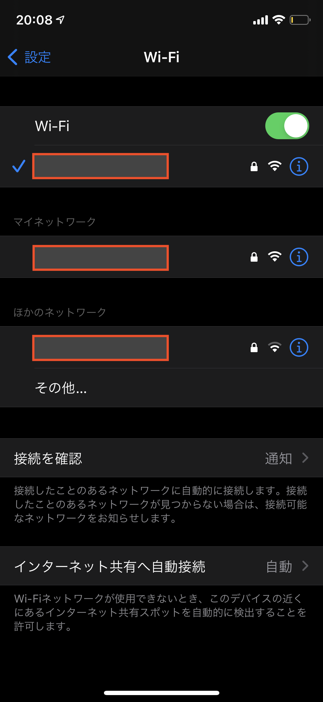
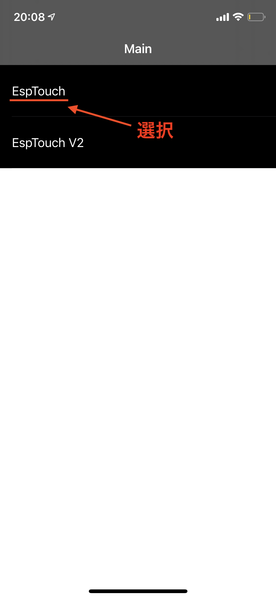
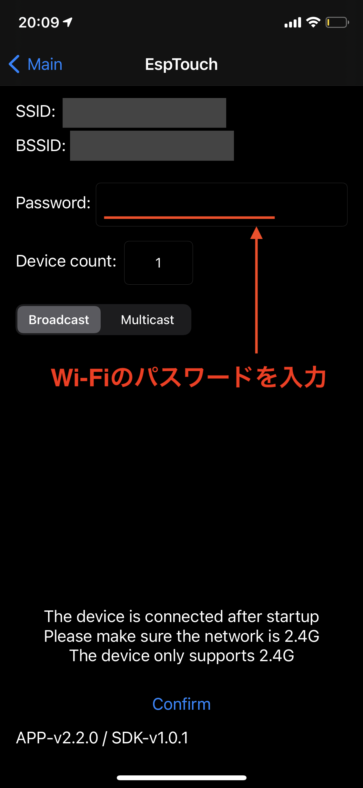
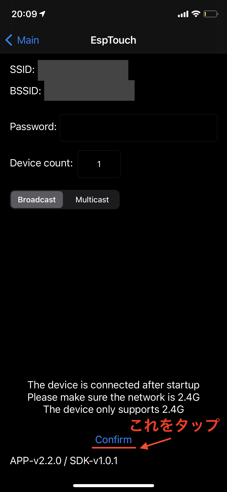

# D+IO 基本ドキュメント

## A. M5Stack開発環境のダウンロードとインストール

### 1. USBドライバーのインストール

※ M5StickC /M5StickC PLUS / M5StickT / ATOM Matrix / ATOM Lite の場合はUSBドライバーのインストールは不要です。

下記リンクを参考にUSBドライバーをインストールしてください。

https://docs.m5stack.com/en/arduino/arduino_development#usb-driver

### 2. Arduino IDEのインストール

下記リンクを参考にArduino IDEをインストールしてください。

https://docs.m5stack.com/en/arduino/arduino_development#arduino-ide

### 3. ボード設定

下記リンクを参考にボード設定を行ってください。

https://docs.m5stack.com/en/arduino/arduino_development#boards-manager

※ Arduino IDEの環境設定の追加のボードマネージャにはこちらのURLを記入してください。

https://m5stack.oss-cn-shenzhen.aliyuncs.com/resource/arduino/package_m5stack_index.json

### 4. M5Stackライブラリのインストール

下記リンクを参考にArduino IDEをインストールしてください。

https://docs.m5stack.com/en/arduino/arduino_development#m5stack-library

## B. 「Espressif Esptouch」アプリを使ったM5Stack/ESPシリーズのWi-Fiの設定方法

1. 下記URLからスマートフォンにアプリをインストールします

	※ Androidもアプリがあるようですが、公式のアプリは存在しないようです。

	[https://apps.apple.com/jp/app/espressif-esptouch/id1071176700](https://apps.apple.com/jp/app/espressif-esptouch/id1071176700)

1. あらかじめスマートフォンを設定したいWi-Fiに接続しておきます

    

    2.4GHzのWi-Fiに接続してください。

1. 「Espressif Esptouch」アプリを起動し、「EspTouch」を選択します。

    

1. 「Espressif Esptouch」アプリを起動し、「EspTouch」を選択します。

    

1. 下部の「Confirm」をタップし、10〜30秒ほど待って接続完了のポップアップがでたら完了です。

    
